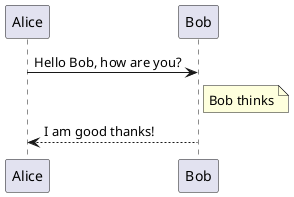

# IceThimble

This repository includes the code used for our edited files for use of the [SimpleThimble Project](https://simplethimble.readthedocs.io/en/latest/index.html "Original project documentation").

The updated code is modified to a Tiny Pico platform (using ESP32) for both hand device and dongle. 
The esp32 servo library is required. 

## Micro ROS version
In adittion a new version using micro ros for arduino is added. A micro ros host need to be set up on the host computer and the communication os made on a topic ok the host. omputer. Due too difficulties with dynamic list, twist is used as message type. This is the connection between twist and fingers are

linear:
x - thumb
y - index
z - middle

linear:
x - ring
y - little
z - palm

## How To Use

To operate the IceThimble first clone the code in the IceThimble repository [IceThimble Github](https://github.com/Microttus/IceThimble/). 
Open the code in a microcontroller IDE of choice. 
Arduino official IDE is a perfectly fine choice and is available here: [Arduino IDE](https://www.arduino.cc/en/software).

To be able to use an ESP bootloader,
go to Board Manager and install the _esp32_ by Espressif. 
Connect your TinyPICO board and in the top of the window, choose the active USB port 
and select UM TinyPICO as a device type. 
Before uploading the code, the correct Wi-Fi 
settings should be set.

```c++
set_microros_wifi_transports("your_id", "your_pw", "host_ip", 8888);
```

In the void setup function, the code line  
which has to be altered for your configurations. 
Mark that these configurations should be written in as strings. 
The first parameter is your network ID, 
the second your network password, and the third is the IP address of the computer 
which shall be used as host. 
The last parameter sets the UDP port used for the communication. 
Your network IP address can be found using the following command in a terminal. 
Finally, upload the code to the microcontroller and unplug it.


```text
ip a
```

To proceed, a computer with Ubuntu 22 installed is necessary in addition to ROS Humble. A guide on how to install ROS can be found here \url{https://docs.ros.org/en/humble/Installation/Ubuntu-Install-Debians.html}. When ROS is installed, the MicroROS agent can be installed with snap using this command.

```text
sudo snap install micro-ros-agent
```

Both computer and microcontroller must be connected to the same network. 
The network configuration should as mentioned above be set for the microcontroller. 
Now launch the MicroROS agent with the following line. 
The port number must be the same as in the configuration line in the Arduino code.

```text
micro-ros-agent udp4 -p 8888
```

The battery can now be connected to the servo hat connected to the microcontroller. 
The status led should first light blue, and then the servos should do a startup sequence. 
If no error is rained, the LED should turn green, indicating that it is connected and the main loop is spinning. 
If a problem is detected, the LED indicator will turn red. 
If the green light is turned on, some status messages in the terminal which the agent was launched should be visible. 
Among other things, describing which nodes and topics is created.

Values between 0 and 254 can now be posted on the created topics for control of the position of the thimble device. 
The following line can be used to publish a single message on the topic.
The finger devices should then alter its position accordingly.

```text
ros2 topic pub -once /finger_force geometry_msgs/msg/Twist "{linear: {x: 200.0, y: 200.0, z: 200.0}, angular: {x: 200.0, y: 200.0, z: 200.0}}"
```





